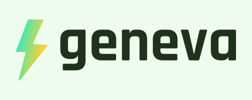

Geneva renders video from a JSON document, and does everyday edits as
one-line commands that compile to the same documents. It is built on
FFmpeg's libraries, so it reads and writes what ffmpeg reads and writes.
What it adds is an opinion about defaults, and a report that says what it
did and why.

One binary, no services, no network access, MIT licensed. Linux and macOS.

**Status: 0.4.** The format, the renderer, the everyday verbs and the
encoders work end to end. GPU rendering is not there. The timeline format
is versioned and will keep changing until 1.0; see
[CHANGELOG.md](CHANGELOG.md).

```sh
geneva trim talk.mp4 -o intro.mp4 --to 30s        # copies the streams, no re-encode
geneva convert talk.mp4 -o reel.mp4 --for tiktok  # size, codec, quality, caps from a table
geneva render job.json -o out/                    # every output in the document, one pass
```

## Why this rather than ffmpeg

ffmpeg is the better tool for most things and geneva is built on its
libraries. These are the places where geneva does something ffmpeg does
not.

### It tells you what it did

Every run prints one report: the same facts as prose for a person, or as
one JSON document for a program. Not a log to grep, a result to read.

```
$ geneva trim talk.mp4 -o cut.mp4 --from 0.5s --to 1.5s
note[N600]: the video stream is used as is, so it is copied without re-encoding
  --> (document)
note[N600]: cut at 0.5s moved to the keyframe at 0.48s
  --> (document)
ok: 2 notes
wrote cut.mp4 (1s, streams copied without re-encoding, 0.0s elapsed)
```

When it cannot do the fast thing, it names the fact that stopped it rather
than falling back in silence:

```
note[N600]: not copied without re-encoding: the audio of talk.mp4 is aac, which wav cannot hold
```

### It refuses to guess

A timeline is checked before anything is decoded. Every problem carries a
code, a JSON pointer into your document, the offending value and a fix.
Unknown fields are errors, so a typo is caught rather than ignored.

```
$ geneva validate job.json
error[E301]: clip 0 of layer 0 lasts 6s but its source range is only 2s
  --> /layers/0/clips/0/duration = "6s"
   = help: shorten the duration or widen the in/out range
invalid: 1 error
```

### It gets the quiet things right by default

These are the cases where a filter chain does something plausible and
wrong, and nothing tells you:

- **Colour.** Standard-definition sources stay BT.601 and high-definition
  stays BT.709, tags travel into the output file, and untagged material is
  inferred from its size with the assumption written in the report.
  Compositing happens in linear light.
- **HDR.** A phone's HLG or PQ clip becomes SDR by ITU-R BT.2446 method A,
  the conversion the recommendation specifies, rather than a curve that
  sends every highlight to white. `--keep-hdr` keeps it HDR, with the tags
  and a ten-bit codec.
- **Speed and cuts.** A speed change keeps audio in sync and shifts its
  pitch with it. A cut lands where you asked or on the previous keyframe,
  and the report says which.
- **Phone recordings.** Rotation flags are honoured, and jittered
  timestamps do not defeat the copy planner.

Timing is held to this by a corpus of fourteen files built to break it:
variable frame rate, edit lists, negative composition offsets, audio that
starts late, 29.97 in a 600-tick timebase, a stream that starts at ten
seconds.

### It copies when copying is correct

Trims, joins and format changes that leave the picture alone copy the
coded packets instead of re-encoding, which takes about as long as reading
the file. You do not have to know when that is safe: the planner decides,
and when it refuses it names the reason. `--for` does the same, so a file
that already meets the target is copied rather than re-encoded into an
identical one.

With `--exact`, a cut that has to land on a precise frame re-encodes only
the frames between the cut and the next keyframe, and copies the rest into
the same track:

```
note[N600]: smart cut: 50 of 75 frames copied from the source, 25 encoded in 1 run around the cuts and overlays
```

### One document, many outputs

An `outputs` map says what one render should produce: renditions at several
sizes, a poster still, a sprite sheet with the WebVTT map players use for
seek previews, the audio alone for a transcriber. The frames are composited
once and the report lists every file with its size and media type.

```json
"outputs": {
  "1080p":  { "kind": "video" },
  "720p":   { "kind": "video", "height": 720 },
  "poster": { "kind": "poster" },
  "speech": { "kind": "audio", "audio": { "sample_rate": 16000, "channels": 1 } }
}
```

### Destinations instead of parameters

`--for web`, `--for tiktok`, `--for email` set size ceiling, codec, level,
quality, bitrate cap, keyframe interval, fast start and audio from one
table. The table is data, `geneva targets` prints it with the source and
date of each platform's numbers, and the choices land in the document where
`--show-timeline` shows them.

### It is made to be driven by programs

`--format json` puts one JSON document on stdout and a stream of progress
objects on stderr, so a pipeline can follow a long render and still read
the result. Renders are deterministic: the same document, assets and
version give the same frames, so results can be cached by input hash.
[docs/agents.md](docs/agents.md) is the page for code and agents.

## What ffmpeg does better

Nearly everything else, and it is worth being plain about it:

- Hundreds of filters. Geneva has crop, fit, blur, masks and speed.
- Streaming and devices: RTMP, SRT, HLS, capture cards, screen grabs.
  Geneva reads and writes files.
- Breadth of formats. Geneva covers the common ones deliberately.
- Hardware encoding everywhere. Geneva uses VideoToolbox and NVENC when
  they are there, and falls back to software.
- Twenty-five years of hardening, and a community that has seen every
  broken file in existence.

If you know the flags and the file you are working on, ffmpeg will do the
job faster than you can read this page.

## Everyday commands

```sh
geneva trim talk.mp4 -o intro.mp4 --to 30s              # copied, no re-encode
geneva concat part1.mp4 part2.mp4 -o all.mp4            # copied when the streams match
geneva concat a.mp4 b.mp4 -o ab.mp4 --crossfade 0.5s    # rendered
geneva resize talk.mp4 -o talk-720.mp4 --height 720
geneva convert talk.mp4 -o web.mp4 --for web            # copied when a browser already plays it
geneva convert talk.mp4 -o talk.mov --codec prores --profile hq
geneva convert talk.mp4 -o frames/%04d.png              # image sequence
geneva overlay talk.mp4 logo.png -o branded.mp4 --at bottom-right --scale 0.5
geneva audio talk.mp4 -o talk.m4a --extract
geneva audio talk.mp4 -o talk.wav --extract --speech    # 16 kHz mono, for transcription
geneva audio talk.mp4 -o scored.mp4 --mix music.mp3 --gain -12
geneva subtitles talk.mp4 -o subbed.mkv --add en.srt --language en
geneva subtitles talk.mp4 -o burned.mp4 --burn en.srt --fit
geneva frame talk.mp4 -o thumb.jpg                      # first clear frame past the opening
geneva probe talk.mp4                                   # streams, colour tags, what was assumed
```

Any verb prints the document it built with `--show-timeline`, so a quick
job becomes a composition you can edit and re-run with `geneva render`.

## A timeline

```json
{
  "geneva": "0.3",
  "output": { "width": 1280, "height": 720, "fps": 30, "duration": "3s" },
  "assets": { "logo": { "src": "logo.png" } },
  "layers": [
    { "clips": [ { "source": { "kind": "solid", "color": "#1d2230" } } ] },
    {
      "clips": [
        {
          "source": { "kind": "image", "asset": "logo" },
          "start": "0.5s",
          "duration": "2s",
          "transform": {
            "position": { "x": "50%", "y": "50%" },
            "scale": { "keyframes": [
              { "t": 0, "v": 0.6, "ease": "ease-out" },
              { "t": "0.6s", "v": 1.0 }
            ] }
          },
          "opacity": { "keyframes": [ { "t": 0, "v": 0 }, { "t": "0.4s", "v": 1 } ] }
        }
      ]
    }
  ]
}
```

Clips draw solids, shapes, images, video, text and nested compositions,
with transforms, opacity, blend modes, transitions, crops, masks, blur and
speed. Audio tracks mix alongside. See
[docs/timeline.md](docs/timeline.md) for the reference,
[docs/cli.md](docs/cli.md) for the commands and
[docs/errors.md](docs/errors.md) for the diagnostic codes.

## Installing

```sh
curl -fsSL https://raw.githubusercontent.com/geneva-render/geneva/main/scripts/install.sh | sh
```

That fetches the latest release for your machine and installs it to
`/usr/local/bin`, or `~/.local/bin` when the first is not writable
(`GENEVA_PREFIX` overrides). You can instead take an archive from the
[releases page](https://github.com/geneva-render/geneva/releases) and run
the `install.sh` inside it. Each archive holds the binary, the installer, a
check script, this README and the licence texts. On macOS the installer
clears the quarantine flag a browser download carries, so the binary starts
without a Gatekeeper detour.

To see how it behaves on your own machine and your own files, run the check
script. It performs the everyday commands and prints a table of what each
step took next to the time ffmpeg takes for the same step, when ffmpeg is
installed:

```sh
sh check.sh              # a generated test clip
sh check.sh input.mp4    # your own file
```

Linux binaries need glibc 2.35 or newer (Ubuntu 22.04, Debian 12, RHEL 9).
macOS binaries need macOS 12 or newer on Apple silicon. Nothing else is
required: codecs, containers and font shaping are built in.

Software H.264 is the one exception worth knowing. Geneva bundles OpenH264,
which writes larger files than x264 at the same quality. It does not bundle
x264, which is GPL licensed, but it loads the system's copy when one is
installed and the report says which encoder ran:

```sh
sudo apt install libx264-164     # Debian 12, Ubuntu 24.04 (libx264-163 on 22.04)
brew install x264                # macOS
```

Hardware encoders come first when present. `GENEVA_X264=off` turns the
lookup off, `GENEVA_X264=/path/to/libx264.so` names a file.

## How this was built

Every line of this repository was written by Claude, Anthropic's model,
running in Claude Code, working from the direction, review and testing of
one person. That includes the Rust, the tests, this README and the design
documents behind it. The commit trailers record which model wrote each
commit.

That is worth stating plainly rather than burying, for two reasons. If you
are weighing whether to trust the code, you should know where it came from
and read it accordingly. And if you are curious what this way of working
produces, the repository is the artefact: the format design, the colour
pipeline, the copy planner and the corpus of files built to break the
timing were all written this way, and the history shows the bugs found and
fixed along the road.

## Building from source

```sh
scripts/build-media-libs.sh   # builds the media libraries once, 10 to 20 minutes
cargo build --release
```

The script needs a C and C++ toolchain, cmake, meson, ninja, nasm,
pkg-config and clang. [CONTRIBUTING.md](CONTRIBUTING.md) has the
per-platform package lists and the test workflow. Third-party components
and their licences are in
[THIRD-PARTY-NOTICES.md](THIRD-PARTY-NOTICES.md).

## Repository layout

| Path | Contents |
| --- | --- |
| `crates/geneva-timeline` | Timeline format: types, parsing, validation, resolution, JSON Schema |
| `crates/geneva-anim` | Keyframes and easing; animation as a pure function of time |
| `crates/geneva-color` | Colour tags, inference, transfer functions, matrices, linear-light blending |
| `crates/geneva-render` | Renderer interface and the CPU reference renderer |
| `crates/geneva-golden` | Perceptual image comparison and the golden-frame test driver |
| `crates/geneva-media` | Probing, decoding, encoding and audio mixing over the bundled media libraries |
| `crates/geneva-cli` | The `geneva` command-line tool |
| `schema/` | Published JSON Schema files, one per timeline version |
| `docs/` | Format reference, command line, agent guide, diagnostics, colour, architecture |
| `tests/golden/` | Golden scenes, their reference frames, and the fonts they use |
| `tests/media/` | Small media files used by tests, including the timing corpus |
| `scripts/` | Media library build, install, check and benchmark scripts |
| `licenses/` | Licence texts of the bundled third-party components |

## Licence

Geneva is open source under the [MIT Licence](LICENSE). The bundled
third-party components and their licences are listed in
[THIRD-PARTY-NOTICES.md](THIRD-PARTY-NOTICES.md).
