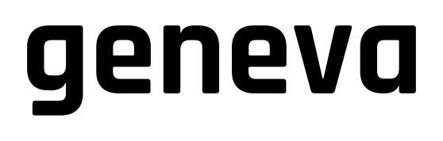

geneva is a programmatic video editor, built as an alternative to the ffmpeg command line. It's designed to work well with AI agents, too.

Simple jobs take one line. More complex ones go in as JSON + optional assets, so you can read, diff, validate and check into git.

geneva validates the job before decoding anything, so bad options fail
immediately instead of an hour into the render. It also reports what it
is doing as it runs.

```sh
geneva trim talk.mp4 -o intro.mp4 --to 30s        # copies the streams, no re-encode
geneva subtitles talk.mp4 -o subbed.mp4 --burn transcript.json --highlight "#ffd233"
geneva render job.json -o out/                    # everything the document asks for
```

Under the hood is a compositor: layers, keyframes, shaped text, masks and
blend modes. Overlays use HTML and CSS, including flexbox, the box model
and `@keyframes`, without a browser. Colour is handled in linear light,
and video goes through libavformat and libavcodec.

## How it works

Here is a name card and captions over ten seconds of space-station
footage. The card is just an HTML file. Open it in a browser and it looks and
moves the same:

```html
<!-- A lower third. Open this file in a browser: it looks and moves the same. -->
<style>
  @keyframes slide-in { from { translate: -100% } to   { translate: 0 } }
  @keyframes fade-in  { from { opacity: 0 }      to   { opacity: 1 } }
  @keyframes fade-out { from { opacity: 1 }      to   { opacity: 0 } }

  .card {
    animation: slide-in 0.5s ease-out, fade-in 0.3s, fade-out 0.3s 3.7s;

    position: absolute;
    left: 4.4%;
    top: 7.5%;
    width: 33%;

    display: flex;
    flex-direction: column;
    gap: 6px;
    padding: 14px 24px;
    box-sizing: border-box;

    background: #0a0f14cc;
    border-left: 5px solid #c4362f;
    box-shadow: 0 4px 18px #00000059;
  }

  .card h1 {
    margin: 0;
    font: 600 29px Liberation Sans;
    color: #f2f5f7;
  }

  .card p {
    margin: 0;
    font: 500 13px Liberation Sans;
    letter-spacing: 1.4px;
    color: #94a6b6;
  }
</style>

<div class="card">
  <h1>Dragon CRS-17</h1>
  <p>BERTHING AT THE ISS &nbsp;&middot;&nbsp; NASA</p>
</div>
```

The captions come from `words.json`, a Whisper transcript pasted in
as-is. The JSON ties the footage, card and captions together:

```json
{
  "geneva": "0.3",
  "output": { "width": 1280, "height": 720, "fps": 30 },

  "assets": {
    "iss":   { "src": "iss.mp4" },
    "card":  { "src": "card.html" },
    "words": { "src": "words.json" }
  },

  "layers": [
    { "id": "footage", "clips": [ { "source": { "kind": "video", "asset": "iss" } } ] },

    { "id": "captions", "clips": [ {
        "source": {
          "kind": "captions", "asset": "words", "margin": "9%",
          "style": {
            "font": "500 34px/1.35 Liberation Sans",
            "color": "#b6c2cd",
            "highlight": { "color": "#ffffff" },
            "background": "#0a0f14cc",
            "padding": "14px",
            "radius": 3,
            "max_width": "66%"
          } } } ] },

    { "id": "lower-third", "clips": [ {
        "source": { "kind": "html", "asset": "card" },
        "start": "2s", "duration": "4s" } ] }
  ]
}
```

```sh
geneva render examples/lower-third.json -o dragon.mp4
```


```text
note[N453]: 2 cues read from "words.json"
note[N600]: smart cut: 135 of 300 frames copied from the source, 165 encoded in 1 run around the cuts and overlays
note[N600]: H.264 runs encoded with the system's x264 (build 164) at CRF 18
wrote dragon.mp4 (300 frames, 10s of video, 4.2s elapsed)
```

The document controls when things appear. The HTML controls how they
look. geneva handles the CSS layout itself, without a browser.
Percentages are relative to the frame, so the layout scales with the
output.

Because nothing is on screen for the first second or the last four, 135
of the 300 frames are copied instead of re-encoded.

## An opening

The same idea carries a title sequence. An LLM can write one in HTML and
CSS ([opening.html](examples/opening.html): typed-on text, a gradient
sweeping through it, a blur, a diagonal wipe), and geneva plays it over
footage from one document ([opening.json](examples/opening.json)),
with the wipe revealing the clip and a fade to black at the end.


## Installing

```sh
curl -fsSL https://raw.githubusercontent.com/geneva-render/geneva/main/scripts/install.sh | sh
```

The archives are on the [releases
page](https://github.com/geneva-render/geneva/releases) if you would
rather pick one yourself. Linux needs glibc 2.35+, macOS 12+ on Apple
silicon. Codecs, containers and font shaping are built in.

One thing to know about H.264: geneva bundles OpenH264, which produces
larger files than x264 at the same quality. It does not bundle x264
because it is GPL, but it will use your system copy if available and
always reports which encoder it used.

```sh
sudo apt install libx264-164     # Debian 12, Ubuntu 24.04 (libx264-163 on 22.04)
brew install x264                # macOS
```

## What else it does

| | What it does | Where |
| --- | --- | --- |
| **Cut and join without re-encoding** | Copies the streams instead of decoding and encoding them again | [examples](examples/README.md#cuts-that-dont-re-encode) |
| **Several outputs in one pass** | Multiple renditions, a poster, and speech audio from one read | [examples](examples/README.md#one-read-many-files) |
| **Vertical video reframing** | Turns 16:9 into 9:16 over a blurred copy instead of cropping | [examples](examples/README.md#vertical-video) |
| **Destination presets** | `--for instagram`, `--for web`, `--for phone` set size, codec, quality, keyframes and audio, and warn when limits are exceeded | [docs/cli.md](docs/cli.md#targets) |
| **Transitions** | Dissolve or dip through a colour at joins or clip boundaries, with picture and sound kept together | [docs/timeline.md](docs/timeline.md#transitions) |
| **Colour** | Preserves BT.601/BT.709, reports guesses for untagged material, and tone-maps HDR with BT.2446 | [docs/color.md](docs/color.md) |
| **Scripts and agents** | `--format json`, field-level diagnostics, deterministic output | [docs/agents.md](docs/agents.md) |

## Commands

```sh
geneva resize talk.mp4 -o talk-720.mp4 --height 720
geneva trim talk.mp4 -o clip.mp4 --from 12s --exact     # frame-accurate, smart cut
geneva concat part1.mp4 part2.mp4 -o all.mp4            # copied when the streams match
geneva concat a.mp4 b.mp4 -o ab.mp4 --crossfade 0.5s    # dissolve, picture and sound
geneva concat a.mp4 b.mp4 -o ab.mp4 --fade 0.6s         # dip through black
geneva overlay talk.mp4 logo.png -o branded.mp4 --at bottom-right --scale 0.5
geneva convert talk.mp4 -o web.mp4 --for web            # copied if a browser can already play it
geneva convert talk.mp4 -o talk.mov --codec prores --profile hq
geneva convert talk.mp4 -o frames/%04d.png              # image sequence
geneva audio talk.mp4 -o talk.wav --extract --speech    # 16 kHz mono, for whisper etc.
geneva audio talk.mp4 -o scored.mp4 --mix music.mp3 --gain -12
geneva subtitles talk.mp4 -o burned.mp4 --burn en.srt --fit
geneva frame talk.mp4 -o thumb.jpg                      # first clear frame past the opening
geneva probe talk.mp4                                   # streams, colour tags, what was guessed
```

`geneva targets` prints the preset table. Add `--show-timeline` to any
command to print its JSON instead of rendering it. It is the quickest way
to get a working document.

## Documentation

| Page | What's in it |
| --- | --- |
| [examples/README.md](examples/README.md) | Examples with their document, command and output |
| [docs/timeline.md](docs/timeline.md) | The format, fields, defaults and rules |
| [docs/cli.md](docs/cli.md) | Commands, flags, targets, containers and codecs |
| [docs/agents.md](docs/agents.md) | The short version for scripts and AI agents |
| [docs/errors.md](docs/errors.md) | Error codes and what to do about them |
| [docs/color.md](docs/color.md) | Colour tags, guessing, working space and HDR |
| [docs/architecture.md](docs/architecture.md) | Renderer, copy planner and encoders |
| [CHANGELOG.md](CHANGELOG.md) | Version changes and unresolved format decisions |

## How this was built

This was built almost entirely with Fable/Opus, which wrote the code,
tests and docs under my guidance. I am being upfront about that so you
can decide how much you trust the code.

## Building from source

```sh
scripts/build-media-libs.sh   # builds the media libraries once, 10 to 20 minutes
cargo build --release
```

You will need a C/C++ toolchain, cmake, meson, ninja, nasm, pkg-config
and clang. [CONTRIBUTING.md](CONTRIBUTING.md) lists the packages for each
platform and explains how to run the tests.
[docs/architecture.md](docs/architecture.md) maps the crates.

## Licence

MIT.

See [LICENSE](LICENSE).

Bundled third-party components and their licences are listed in
[THIRD-PARTY-NOTICES.md](THIRD-PARTY-NOTICES.md).
