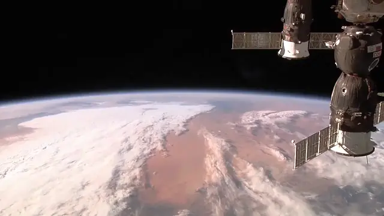

**Video edits as JSON, overlays as HTML+CSS, rendered without a browser.**

This started as a rewrite of ffmpeg's CLI in Rust. The core codecs still come from libav*, but everything on top of them is new: a planner that works out the cheapest way to produce an edit, a proper compositor with layers, keyframes, masks, transitions etc., and a layout engine that draws titles and graphics written in plain HTML and CSS, natively and [quickly](docs/benchmarks.md). No filtergraphs, no Playwright, no headless browsers. All in a single binary, without dependencies.

https://github.com/user-attachments/assets/6d8566dd-7270-49bc-ac66-dab1585817a3

<sub>An AI agent made this on its first try, from one prompt, with nothing but whisper-cli and a single geneva command. [The prompt is below.](#made-to-be-driven-by-agents)</sub>

## Install

```sh
# Linux, macOS
curl -fsSL https://raw.githubusercontent.com/geneva-render/geneva/main/scripts/install.sh | sh
```

```powershell
# Windows (PowerShell)
irm https://raw.githubusercontent.com/geneva-render/geneva/main/scripts/install.ps1 | iex
```

Or download an archive from [Releases](https://github.com/geneva-render/geneva/releases). Runs on Linux (x64, arm64), macOS on Apple silicon and Windows x64. Everything it needs is inside the binary.

## The everyday things

```sh
geneva trim match.mp4 -o goal.mp4 --from 41:10 --to 41:40   # no re-encode, done in a blink
geneva concat day1.mp4 day2.mp4 -o trip.mp4 --crossfade 1s
geneva convert talk.mov -o talk.mp4 --for web               # sensible codec, size and settings for the destination
geneva subtitles talk.mp4 -o talk-subbed.mp4 --burn talk.srt
geneva probe talk.mp4                                       # what's actually in the file
```

Every command is translated into a validated JSON document describing the edit, which geneva renders as-is. You can also add `--show-timeline` to see it. All commands and flags are here: [docs/cli.md](docs/cli.md).

## How it works

A name card slides in at 2 seconds and fades out 4 seconds later, over ten seconds of footage. The card is an HTML file, and it looks and moves the same in a browser:

```html
<style>
  @keyframes slide-in { from { translate: -100% } to { translate: 0 } }
  @keyframes fade-in  { from { opacity: 0 } to { opacity: 1 } }
  @keyframes fade-out { from { opacity: 1 } to { opacity: 0 } }

  .card {
    animation: slide-in 0.5s ease-out, fade-in 0.3s, fade-out 0.3s 3.7s;
    position: absolute; left: 4.4%; top: 7.5%; width: 33%;
    display: flex; flex-direction: column; gap: 6px;
    padding: 14px 24px;
    background: #0a0f14cc; border-left: 5px solid #c4362f;
    box-shadow: 0 4px 18px #00000059;
  }
  .card h1 { margin: 0; font: 600 29px Liberation Sans; color: #f2f5f7 }
  .card p  { margin: 0; font: 500 13px Liberation Sans; letter-spacing: 1.4px; color: #94a6b6 }
</style>

<div class="card">
  <h1>Dragon CRS-17</h1>
  <p>BERTHING AT THE ISS &nbsp;&middot;&nbsp; NASA</p>
</div>
```

A JSON document says when it appears:

```json
{
  "geneva": "1.0",
  "output": { "width": 1280, "height": 720, "fps": 30 },
  "assets": { "iss": { "src": "iss.mp4" }, "card": { "src": "card.html" } },
  "layers": [
    { "id": "footage", "clips": [ { "source": { "kind": "video", "asset": "iss" } } ] },
    { "id": "card", "clips": [ { "source": { "kind": "html", "asset": "card" }, "start": "2s", "duration": "4s" } ] }
  ]
}
```

```text
$ geneva render dragon.json -o dragon.mp4
note[N600]: smart cut: 165 of 300 frames copied from the source, 135 encoded in 1 run around the cuts and overlays
note[N600]: H.264 runs encoded with the system's x264 (build 164) at CRF 18
wrote dragon.mp4 (300 frames, 10s of video)
```

The box grows to fit its text. Percentages are relative to the frame, so the same card works at any output size. Frames with nothing on them aren't re-encoded: with an H.264 source and x264 installed they're copied straight from the source; otherwise they go from decoder to encoder without touching the compositor.

Word-by-word captions are one more layer, which reads the Whisper transcript as it is ([examples/lower-third.json](examples/lower-third.json)):



### The same card in ffmpeg

```sh
ffmpeg -i iss.mp4 -filter_complex "
  color=c=0x0a0f14@0.8:s=422x82:d=4,format=rgba,
  drawbox=w=5:h=ih:c=0xc4362f:t=fill,
  drawtext=fontfile=LiberationSans-Bold.ttf:text='Dragon CRS-17':fontsize=29:fontcolor=0xf2f5f7:x=29:y=14,
  drawtext=fontfile=LiberationSans-Regular.ttf:text='BERTHING AT THE ISS  ·  NASA':fontsize=13:fontcolor=0x94a6b6:x=29:y=56,
  fade=t=in:d=0.3:alpha=1,fade=t=out:st=3.7:d=0.3:alpha=1,
  setpts=PTS+2/TB[card];
  [0:v][card]overlay=x='56-422*pow(1-min((t-2)/0.5\,1)\,3)':y=54:eof_action=pass
" dragon.mp4
```

This kinda works, eh. But `drawbox` can't read the width `drawtext` measured, so every size in there is a pixel a human (or an AI) had to measure. There are no rounded corners, no letter-spacing and no blurred shadow on the box, so the card above has to be made in another tool first. Word-by-word captions need a script to turn the transcript into an ASS file, and ASS still can't round the box or keep it even behind the lit word. And all 300 frames get re-encoded, including the 180 with nothing on them.

## Not a wrapper

Wrappers like ffmpeg-python or fluent-ffmpeg give you a nicer way to write the same filtergraph, so they inherit what the filtergraph can't do. geneva never writes an ffmpeg command. It reads the whole edit first and decides how to carry it out, and that's what makes the rest possible:

- **It does less work.** Streams that can be copied are copied. A frame-accurate cut re-encodes only the frames between the cut and the next keyframe (when your system has x264; see below). Frames with nothing drawn on them skip the compositor, or with x264 are copied as they are. Changing only the sound leaves the picture alone. ffmpeg can do much of this if you know the flags; geneva does it without being asked.
- **It catches mistakes before the render, not after.** The whole edit is checked up front, and a problem comes back with a code, its place in the document and usually a hint:

  ```text
  error[E200]: unknown asset "crad"
    --> /layers/2/clips/0/source/asset = "crad"
     = help: did you mean "card"? assets are declared under "assets"
  ```

  ffmpeg is happy to hand you a broken file and exit 0. In a small test I ran (20 editing tasks answered blind by one model, twice; I wrote the tasks, so it's a hint, not a benchmark), the ffmpeg answers produced 8 files that exited 0 and were quietly wrong: shifted colours, cuts tens of milliseconds off, sound drifting out of sync. The geneva answers got all 20 right in both runs, once I'd fixed the one bug the test turned up.
- **It has an actual compositor.** Layers, keyframes, masks, blend modes and transitions on exact frame times, blended in linear light, with colour metadata kept and HDR tone-mapped when needed. Animations are worked out from each frame's timestamp, so frame 1234 is the same picture every time. GPU when you have one, CPU when you don't.
- **It tells you what it did.** Every run ends with a few notes: the encoder it picked, what it copied, what it had to guess about your source. `--format json` makes all of it machine-readable.

**"Couldn't I use Playwright and ffmpeg, or Remotion?"** You could, and people do: screenshot the HTML frame by frame in a headless browser, then have ffmpeg lay the shots over the footage. Everything apart from the overlay is still ffmpeg flags. The browser's animations run on the wall clock, so its clock has to be faked for every frame, and it's a second full encode, with Chromium, Node and ffmpeg to install first. Remotion packages the same approach and its docs say not to use CSS `@keyframes` or transitions, since frames render out of order; geneva plays them as written. On the same 4-core machine with the same x264 settings, the name card and captions above took 4.3 seconds, against 16.4 for Playwright plus ffmpeg and 14.5 for Remotion at its quickest, and the Popeye video at the top took 74 seconds against 131 for Playwright plus ffmpeg. Across [seven real-world jobs](docs/benchmarks.md), from a vertical social clip to a four-minute subtitle burn, geneva was quicker than both on every one: 2 to 6 times quicker wherever there was footage, and about twice as quick as Remotion on full-screen motion graphics with no footage. What the browser does better: any CSS and any JavaScript, where geneva handles [a subset of CSS](docs/timeline.md#markup) (flexbox, gradients, shadows, clip paths, blend modes, keyframes) and no JavaScript.

## Made to be driven by agents

Everything an agent needs is in the binary: `geneva guide` prints the manual, `geneva explain <code>` explains any error, and `--format json` works on every command. Documents are plain JSON with a [published schema](docs/timeline.md), and graphics are HTML and CSS, which models already write well.

The video at the top is an agent's first attempt with that and nothing else. It worked out the layout, wrote the lower third in HTML and CSS, pulled the headlines from a Whisper transcript of the clip, and rendered it, all from this prompt:

> Using only the built-in geneva guide and whisper-cli, take a 1m clip
> from public-domain popeye and overlay a realistic CNN style animated
> lower third for the whole clip (change the CNN logo to GNN, keep the
> style), with headlines derived from the clip itself. The source is 4:3,
> so output 16:9 1080p with the empty sides filled by a blurred copy of
> the video.

## H.264 and x264

geneva ships with OpenH264 for H.264. If x264 is installed on your system, geneva uses it instead, and you get noticeably smaller files. I don't bundle it because it's GPL and geneva is MIT.

```sh
sudo apt install libx264-164   # Debian 12, Ubuntu 24.04 (libx264-163 on 22.04)
brew install x264              # macOS
```

On Windows, drop `libx264-<build>.dll` next to `geneva.exe` (MSYS2's `mingw-w64-ucrt-x86_64-libx264` has one), or point `GENEVA_X264` at it.

## Docs

- [Commands and flags](docs/cli.md)
- [The document format](docs/timeline.md)
- [Examples](examples/README.md)
- [For scripts and agents](docs/agents.md)
- [Error codes](docs/errors.md)
- [Colour and HDR](docs/color.md)
- [Benchmarks](docs/benchmarks.md)
- [Architecture](docs/architecture.md)
- [Changelog](CHANGELOG.md)

## How this was built

This was built almost entirely with Fable/Opus, which wrote the code,
tests and docs under my guidance. I am being upfront about that so you
can decide how much you trust the code.

## Where it's at

geneva is young, and for now it's just the engine: no GUI, no hosted service. What I build next depends on what people make with it, so if that's you, or you'd like it to be, [I'd love to hear what you're working on](https://genevarender.com/building). Issues and [discussions](https://github.com/geneva-render/geneva/discussions) are open.

## Building from source

```sh
scripts/build-media-libs.sh   # builds the media libraries once, takes a while
cargo build --release
```

[CONTRIBUTING.md](CONTRIBUTING.md) has the toolchain for each platform and how to run the tests.

## Licence

MIT. Bundled libraries and their licences are listed in [THIRD-PARTY-NOTICES.md](THIRD-PARTY-NOTICES.md).
