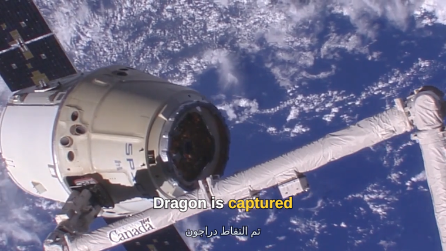
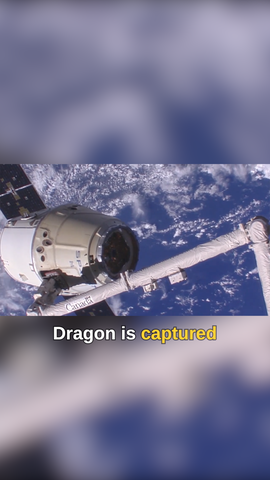

<picture>
  <source media="(prefers-color-scheme: dark)" srcset="docs/wordmark-dark.png">
  
</picture>

geneva turns a JSON file into a video.

It also handles the quick jobs from the command line. Trim a clip. Join two
files. Resize, burn in subtitles, pull the audio out. Each of those commands
writes the same JSON under the hood, and `--show-timeline` prints it, so you
can grab it and keep editing.

Under the commands there's a real compositor: layers, keyframes, text that
shapes properly, masks, blend modes. Overlays can be written as HTML and
CSS — flexbox, the box model, `@keyframes` — and geneva lays them out
itself, with no browser anywhere. Colour is handled in linear light.

One binary. It uses FFmpeg's libraries to read and write files, so it opens
what ffmpeg opens.

```sh
geneva trim talk.mp4 -o intro.mp4 --to 30s        # copies the streams, no re-encode
geneva convert talk.mp4 -o web.mp4 --for web      # one flag instead of fifteen
geneva render job.json -o out/                    # everything the document asks for
```

**Status: 0.4.** The format, the renderer, the commands and the encoders all
work. There's no GPU rendering yet. The format still changes between
versions, and will until 1.0. See [CHANGELOG.md](CHANGELOG.md).

MIT licensed. Linux and macOS. No services, no network access.

## A worked example

Here's a lower third over ten seconds of footage from the space station.
The card is an HTML file — open it in a browser and it looks and moves the
same:

```html
<!-- A lower third. Open this file in a browser: it looks and moves the same. -->
<style>
  @keyframes slide-in { from { translate: -100% } to   { translate: 0 } }
  @keyframes fade-in  { from { opacity: 0 }      to   { opacity: 1 } }
  @keyframes fade-out { from { opacity: 1 }      to   { opacity: 0 } }

  .card {
    animation: slide-in 0.5s ease-out, fade-in 0.3s, fade-out 0.3s 3.7s;

    position: absolute;
    left: 4.4%;
    bottom: 10%;
    width: 44%;

    display: flex;
    flex-direction: column;
    justify-content: center;
    gap: 2px;
    padding: 16px 28px;
    box-sizing: border-box;

    background: #0b1016d9;
    border-radius: 8px;
    border-left: 5px solid #4ade80;
    box-shadow: 0 6px 24px #00000066;
  }
  .card h1 { margin: 0; font: 700 32px Liberation Sans; color: #ffffff }
  .card p  { margin: 0; font: 400 20px Liberation Sans; color: #9fb0bf }
</style>

<div class="card">
  <h1>Dragon CRS-17</h1>
  <p>Berthing at the ISS &nbsp;&middot;&nbsp; NASA</p>
</div>
```

and the whole document that puts it on the footage:

```json
{
  "geneva": "0.3",
  "output": { "width": 1280, "height": 720, "fps": 30 },

  "assets": {
    "iss":  { "src": "iss.mp4" },
    "card": { "src": "card.html" }
  },

  "layers": [
    { "id": "footage", "clips": [ { "source": { "kind": "video", "asset": "iss" } } ] },

    { "id": "lower-third", "clips": [ {
        "source": { "kind": "html", "asset": "card" },
        "start": "2s", "duration": "4s" } ] }
  ]
}
```

```sh
geneva render examples/lower-third.json -o dragon.mp4
```


```
note[N600]: smart cut: 165 of 300 frames copied from the source, 135 encoded in 1 run around the cuts and overlays
note[N600]: H.264 runs encoded with the system's x264 (build 164) at CRF 18
wrote dragon.mp4 (300 frames, 10s of video, 3.5s elapsed)
```

The JSON says only *when*. Everything else is the card's business, and
everything in the card is real CSS: `display: flex` is flexbox, `padding`
and `border-left` are the box model, `position: absolute` with `left` and
`bottom` puts it on the picture the way it would put it on a page. Nothing
measures the text for you — the plate is as tall as the two lines inside it
because that's what a column of flex items does. Geneva parses the markup,
cascades the styles and lays it out with
[taffy](https://github.com/DioxusLabs/taffy), so the layout is an
implementation of the spec rather than a guess at it.

There isn't a pixel coordinate anywhere. `left: 4.4%` and `width: 44%` are
shares of the frame, and `translate: -100%` is the card's own width, so the
slide starts exactly off its own edge — resize the output and the card
follows.

The motion lives in the same file: `@keyframes` and an `animation` on the
card. A slide in, a fade in over the first 0.3 seconds, a fade out starting
at 3.7. The shorthand takes what CSS takes — a duration, a delay, a timing
function, `infinite`, `alternate` — plus `spring(170, 26)`, which CSS
hasn't got.

It is not a browser, and it says so when it matters. There's no inline
layout — an element's text is one paragraph and a child element is a box —
and anything it can't draw is a warning that names it, not a silent
difference.

Underneath it's all keyframes, so anything you can't say in CSS you can say
in the document instead, on any clip and not just markup:

```json
"transform": {
  "position": { "keyframes": [ [0, "-600 648", "ease-out"], ["0.5s", "56 648"] ] }
}
```

Any number you can set, you can animate, either way round.

The last line of the report is the part worth looking at twice. The card is
only on screen for four of the ten seconds. geneva worked out that the rest
of the video is untouched, so it copied 165 frames straight through as they
were and only re-encoded the 135 around the card. Ten seconds took three. On
a ninety-minute film with a watermark on the title card, that's the
difference between a coffee and an afternoon.

### Captions

Speech recognisers write a word and the moment it was said. This is
`whisper --output_format json`, pasted in as it came:

```json
{
  "text": " Dragon is captured by the station arm",
  "language": "en",
  "segments": [
    { "id": 0, "seek": 0, "start": 1.0, "end": 2.6, "text": " Dragon is captured",
      "words": [
        { "word": " Dragon",   "start": 1.0, "end": 1.5, "probability": 0.981 },
        { "word": " is",       "start": 1.5, "end": 1.8, "probability": 0.914 },
        { "word": " captured", "start": 1.8, "end": 2.6, "probability": 0.972 }
      ] },
    ...
  ]
}
```

```sh
geneva subtitles examples/iss.mp4 --burn examples/words.json \
  --highlight "#ffd233" \
  --style '{ "font": "700 44px Liberation Sans", "outline": "3px #000000cc", "max_width": "80%" }' \
  -o captioned.mp4
```


```
note[N600]: smart cut: 183 of 300 frames copied from the source, 117 encoded in 1 run around the cuts and overlays
note[N600]: H.264 runs encoded with the system's x264 (build 164) at CRF 18
wrote captioned.mp4 (300 frames, 10s of video, 2.4s elapsed)
```

No mapping step, no intermediate format. geneva reads the words, groups
them into cues the way a caption editor would — at most two lines, about
forty characters each, nothing on screen for less than a beat — and picks
out whichever word is current. That last part is the style every
short-form platform uses now, and it is only possible because the file
says when each word lands.

It is forgiving about keys and strict about structure: `probability`,
`seek`, `tokens`, WhisperX's `score` and anything else it does not need
are ignored, so whisper, faster-whisper and WhisperX go in unedited, as
does a bare `[{"word", "start", "end"}, ...]`. What it will not do is
draw nothing and call it a success. A file it can find no words in is an
error that says what it looked for, and times that are plainly
milliseconds — AssemblyAI and Deepgram write those — are an error too,
rather than a caption that first appears twenty minutes in:

```
error: reading the words in transcript.json: the times look like milliseconds,
not seconds: a word starts past 1000. Divide them by 1000; geneva reads
seconds, as whisper and whisperx write them
```

`--burn` takes a `.srt` or a `.vtt` too. Those time whole cues rather
than words, so `--highlight` has nothing to pick out, and geneva says so
rather than quietly drawing the same thing:

```
warning[W453]: en.srt has no word times, so nothing is picked out as it is said
  --> /layers/1
   = help: a highlight needs a word file; SubRip and WebVTT time whole cues
```

#### Captions as a layer

`subtitles --burn` is the whole job in one line. When captions are one
part of something larger they are a source like any other, and the same
two kinds of file go in:

```json
"assets": {
  "iss":    { "src": "iss.mp4"    },
  "words":  { "src": "words.json" },
  "arabic": { "src": "ar.srt"     }
},

"layers": [
  { "id": "footage", "clips": [ { "source": { "kind": "video", "asset": "iss" } } ] },

  { "id": "captions", "clips": [ {
      "source": {
        "kind": "captions", "asset": "words", "margin": "15%",
        "style": {
          "font": "700 44px Liberation Sans", "color": "white",
          "highlight": { "color": "#ffd233" },
          "outline": "3px #000000cc", "max_width": "80%"
        } } } ] },

  { "id": "captions-ar", "clips": [ {
      "source": {
        "kind": "captions", "asset": "arabic",
        "style": { "font": "400 30px Liberation Sans", "color": "#cfd8e3",
                   "outline": "3px #000000cc", "max_width": "80%" } } } ] }
]
```

```sh
geneva render examples/captions.json -o captioned.mp4
```



```
note[N453]: 2 cues read from "words.json"
  --> /layers/1/clips/0/source
note[N453]: 2 cues read from "ar.srt"
  --> /layers/2/clips/0/source
note[N600]: smart cut: 183 of 300 frames copied from the source, 117 encoded in 1 run around the cuts and overlays
wrote captioned.mp4 (300 frames, 10s of video, 2.3s elapsed)
```

One line in the document, one clip per cue on the timeline — which is why
183 of the 300 frames were still copied rather than composited. There are
no times and no coordinates to write: the cues carry the timing, and
`"position"` (`bottom`, `top` or `center`) with `"margin"` says where they
sit. A margin defaults to the title-safe inset, so captions stay clear of
the edges a television crops. If a WebVTT file places its own cues,
geneva follows it; `"follow_file": false` overrules it.

The text is properly shaped, so the Arabic line reads right to left, and
Thai would break in the right places. You get wrapping, an outline, a
shadow and a rounded box — and if you know CSS you can write the styles
the CSS way: `"700 44px Liberation Sans"` for the font, `"3px black"` for
the outline.

None of this replaces writing words by hand. A `text` source still takes
a `words` list with the times you choose, which is what you want for
seven words on a title card. A `captions` source is for a file you were
given: it does the grouping and the placing for you. Same renderer, same
style fields.

A caption is drawn into the picture. To carry the same file alongside the
picture as a selectable track instead, it goes in `subtitles[]`, or
`geneva subtitles --add` puts it on a finished file — that is the whole
distinction geneva draws between the two words.

### Vertical video



```sh
geneva render examples/social-reframe.json -o reel.mp4
```

Three layers make a 16:9 clip fit a 9:16 frame without cropping anything
out — the same file twice, then the captions over both:

```json
"output": { "width": 1080, "height": 1920, "fps": 30 },
"assets": { "iss": { "src": "iss.mp4" }, "words": { "src": "words.json" } },

"layers": [
  { "id": "backdrop", "clips": [ {
      "source": { "kind": "video", "asset": "iss", "audio": false },
      "fit": "cover",
      "effects": [ { "kind": "blur", "radius": 45 } ] } ] },

  { "id": "picture", "clips": [ {
      "source": { "kind": "video", "asset": "iss" },
      "fit": "contain" } ] },

  { "id": "captions", "clips": [ {
      "source": {
        "kind": "captions", "asset": "words", "margin": "28%",
        "style": { "font": "700 72px/1.25 Liberation Sans", "color": "white",
                   "highlight": { "color": "#ffd233" },
                   "outline": "4px #000000cc", "max_width": "80%" } } } ] }
]
```

The bottom copy fills the tall frame and gets blurred, the top one sits
whole over it, and the captions are the same `words.json` as above — the
transcript does not care what shape the frame is. `"margin": "28%"` is
the only number that changed, to sit them under the picture band rather
than at the bottom of the canvas.

If you only want the effect and not the document, there's a flag for it:

```sh
geneva convert talk.mp4 -o reel.mp4 --for tiktok --fill blur
```

### Everything a page needs, in one go

A video on a web page usually needs the same pile of files: two or three
sizes, a thumbnail, a sprite sheet for the scrub preview, and the audio on
its own at 16 kHz to feed whisper. List them in one document and geneva
reads the source once instead of six times.

```json
"outputs": {
  "720p":    { "kind": "video" },
  "480p":    { "kind": "video", "height": 480, "encode": { "video": { "crf": 23 } } },
  "360p":    { "kind": "video", "height": 360, "encode": { "video": { "crf": 25 } } },
  "poster":  { "kind": "poster", "width": 960 },
  "preview": { "kind": "sprites", "every": "2s", "columns": 5 },
  "speech":  { "kind": "audio", "path": "speech.wav", "audio": { "sample_rate": 16000, "channels": 1 } }
}
```

```sh
geneva render examples/renditions.json -o out/
```

geneva picks the thumbnail rather than grabbing frame one. It skips the
opening, then takes the first frame that isn't dark and has some movement
behind it, so you don't end up with a black frame or a blurry one. The
sprite sheet comes with the WebVTT file that players expect.

### Cuts that don't re-encode

The same trick from the worked example applies to plain cuts. A trim or a
join that leaves the picture alone copies the packets instead of
re-encoding, which takes about as long as reading the file. You don't have
to know when that's safe, and you don't have to remember `-c copy`.

```
$ geneva trim talk.mp4 -o cut.mp4 --from 0.5s --to 1.5s
note[N600]: the video stream is used as is, so it is copied without re-encoding
note[N600]: cut at 0.5s moved to the keyframe at 0.48s
wrote cut.mp4 (1s, streams copied without re-encoding, 0.0s elapsed)
```

When it can't copy, it says why rather than quietly re-encoding:

```
note[N600]: not copied without re-encoding: the audio of talk.mp4 is aac, which wav cannot hold
```

### Colour

Standard-definition footage stays BT.601 and HD stays BT.709, and the tags
end up in the file you write. If the source has no tags, geneva guesses
from the size and tells you what it guessed.

```
$ geneva probe clip.mp4
  video: h264 720×576 @ 25 fps, yuv420p
    color: primaries untagged, transfer untagged, matrix untagged, range untagged
    assumed: matrix bt601, primaries bt601-625, transfer bt709, range limited (untagged material below HD resolution)
```

An HDR clip off a phone comes back to SDR through ITU-R BT.2446 method A,
which is the conversion the spec asks for, so you don't get the blown-out
highlights a naive curve gives you. `--keep-hdr` keeps it HDR instead.

### Running it from a script

Add `--format json` and stdout becomes one JSON document. Progress goes to
stderr, one object per line, so you can follow a long render and still read
the result at the end.

geneva checks a document before it decodes anything. Every problem comes
with a code, a pointer to the spot in your JSON, the bad value and a fix.
Misspell a field and you get an error, not silence.

```
$ geneva validate job.json
error[E301]: clip 0 of layer 0 lasts 6s but its source range is only 2s
  --> /layers/0/clips/0/duration = "6s"
   = help: shorten the duration or widen the in/out range
```

Renders are deterministic. Same document, same assets, same version, same
frames, so you can cache by input hash. [docs/agents.md](docs/agents.md)
has the rest for scripts and agents.

## Commands

```sh
geneva trim talk.mp4 -o intro.mp4 --to 30s              # copied, no re-encode
geneva trim talk.mp4 -o clip.mp4 --from 12s --exact     # frame-accurate, smart cut
geneva concat part1.mp4 part2.mp4 -o all.mp4            # copied when the streams match
geneva concat a.mp4 b.mp4 -o ab.mp4 --crossfade 0.5s    # rendered
geneva resize talk.mp4 -o talk-720.mp4 --height 720
geneva convert talk.mp4 -o web.mp4 --for web            # copied if a browser can already play it
geneva convert talk.mp4 -o talk.mov --codec prores --profile hq
geneva convert talk.mp4 -o frames/%04d.png              # image sequence
geneva overlay talk.mp4 logo.png -o branded.mp4 --at bottom-right --scale 0.5
geneva audio talk.mp4 -o talk.wav --extract --speech    # 16 kHz mono, for whisper
geneva audio talk.mp4 -o scored.mp4 --mix music.mp3 --gain -12
geneva subtitles talk.mp4 -o burned.mp4 --burn en.srt --fit
geneva frame talk.mp4 -o thumb.jpg                      # first clear frame past the opening
geneva probe talk.mp4                                   # streams, colour tags, what was guessed
```

`--for` sets everything a destination needs at once: the size ceiling, the
codec, the level, the quality, the bitrate cap, the keyframe interval, fast
start and the audio settings. Run `geneva targets` to see the table, with a
source and a date for every platform's numbers.

Add `--show-timeline` to any command and it prints the JSON instead of
rendering. That's the quickest way to a document that already works. Run the
command, keep the JSON, edit it, render it.

## Installing

```sh
curl -fsSL https://raw.githubusercontent.com/geneva-render/geneva/main/scripts/install.sh | sh
```

That grabs the right build for your machine and puts it in `/usr/local/bin`,
or `~/.local/bin` if the first isn't writable. Set `GENEVA_PREFIX` to
override. You can also download an archive from the
[releases page](https://github.com/geneva-render/geneva/releases) and run the
`install.sh` inside it. On macOS the installer clears the quarantine flag, so
you won't get a Gatekeeper dialog.

The archive also carries `check.sh`. Point it at one of your own files and
it runs the everyday commands on it and times each one, next to ffmpeg
doing the same job if you have ffmpeg installed.

Linux builds need glibc 2.35 or newer, so Ubuntu 22.04, Debian 12 or RHEL 9
and up. macOS builds need macOS 12 or newer on Apple silicon. Codecs,
containers and font shaping are all built in.

One thing to know about H.264. geneva bundles OpenH264, which makes bigger
files than x264 at the same quality. It doesn't bundle x264 itself, because
x264 is GPL, but it will use the copy on your system if you have one, and it
says which encoder it used. Hardware encoders come first when they're
available.

```sh
sudo apt install libx264-164     # Debian 12, Ubuntu 24.04 (libx264-163 on 22.04)
brew install x264                # macOS
```

## Documentation

| Page | What's in it |
| --- | --- |
| [docs/timeline.md](docs/timeline.md) | The format: every field, its default and its rules |
| [docs/cli.md](docs/cli.md) | Every command and flag, the `--for` targets, containers and codecs |
| [docs/agents.md](docs/agents.md) | The short version, for scripts and AI agents |
| [docs/errors.md](docs/errors.md) | Every error code and what to do about it |
| [docs/color.md](docs/color.md) | Tags, guessing, the working space, HDR |
| [docs/architecture.md](docs/architecture.md) | How the renderer, the copy planner and the encoders fit together |

## How this was built

Claude wrote all of it, running in Claude Code, directed and reviewed by one
person. That covers the Rust, the tests, these docs and the design notes
behind them. The commit trailers say which model wrote each commit.

It seems better to say that up front than to let you work it out. If you're
deciding whether to trust the code, you should know where it came from. And
if you're curious what this way of working actually produces, the repository
is the answer, bugs and fixes included.

## Building from source

```sh
scripts/build-media-libs.sh   # builds the media libraries once, 10 to 20 minutes
cargo build --release
```

You'll need a C and C++ toolchain, cmake, meson, ninja, nasm, pkg-config and
clang. [CONTRIBUTING.md](CONTRIBUTING.md) lists the packages per platform and
explains how to run the tests. Third-party components and their licences are
in [THIRD-PARTY-NOTICES.md](THIRD-PARTY-NOTICES.md).

## What's where

| Path | What it holds |
| --- | --- |
| `crates/geneva-timeline` | The format: types, parsing, validation, resolution, JSON Schema |
| `crates/geneva-render` | The compositor |
| `crates/geneva-color` | Colour tags, guessing, transfer functions, matrices, linear light |
| `crates/geneva-anim` | Keyframes and easing |
| `crates/geneva-media` | Probing, decoding, encoding, the copy planner, smart cut, mixing |
| `crates/geneva-golden` | Image comparison and the golden-frame tests |
| `crates/geneva-cli` | The `geneva` command |
| `schema/` | Published JSON Schema, one file per format version |
| `tests/golden/` | Golden scenes, their reference frames and fonts |
| `tests/media/` | Small test files, including the fourteen timing traps |

## Licence

MIT. See [LICENSE](LICENSE). The bundled third-party components and their
licences are listed in [THIRD-PARTY-NOTICES.md](THIRD-PARTY-NOTICES.md).
