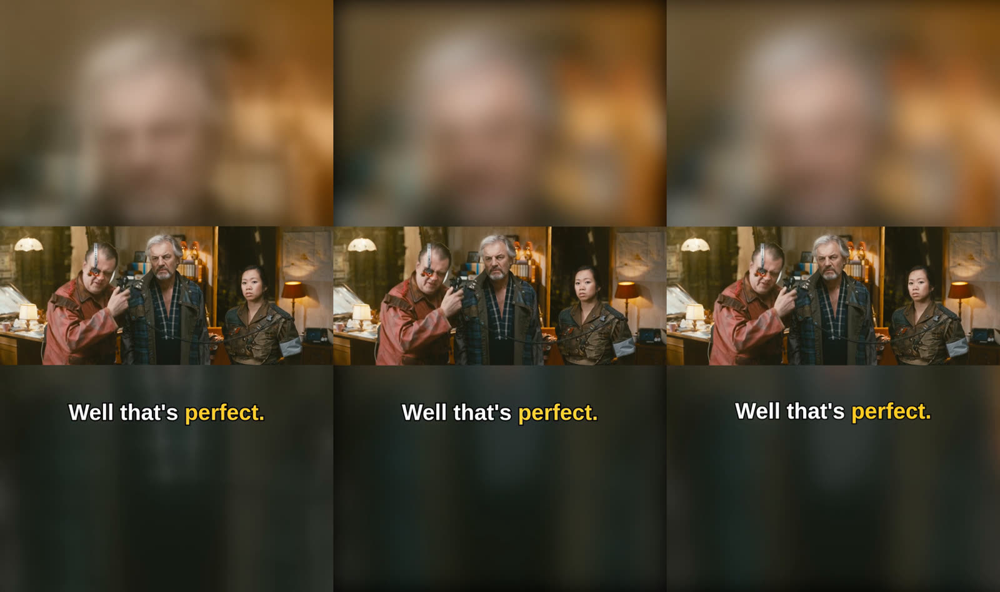
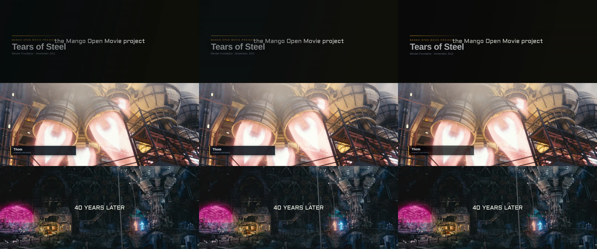
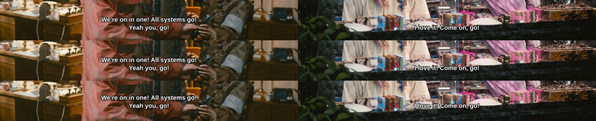
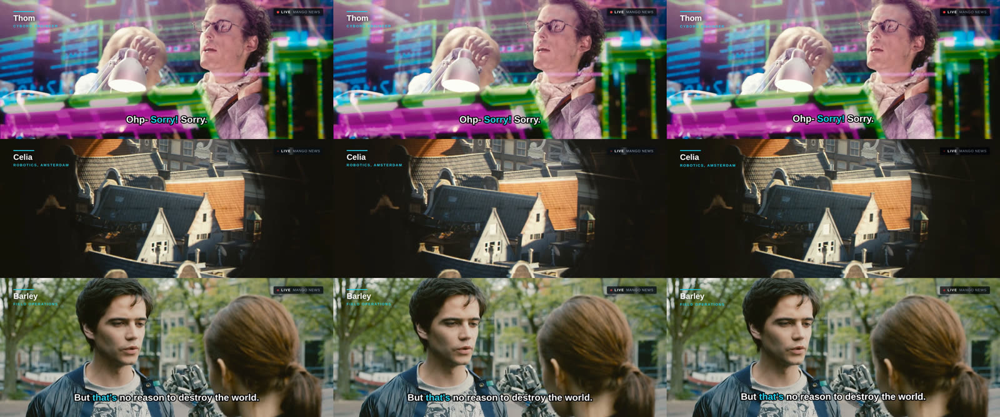
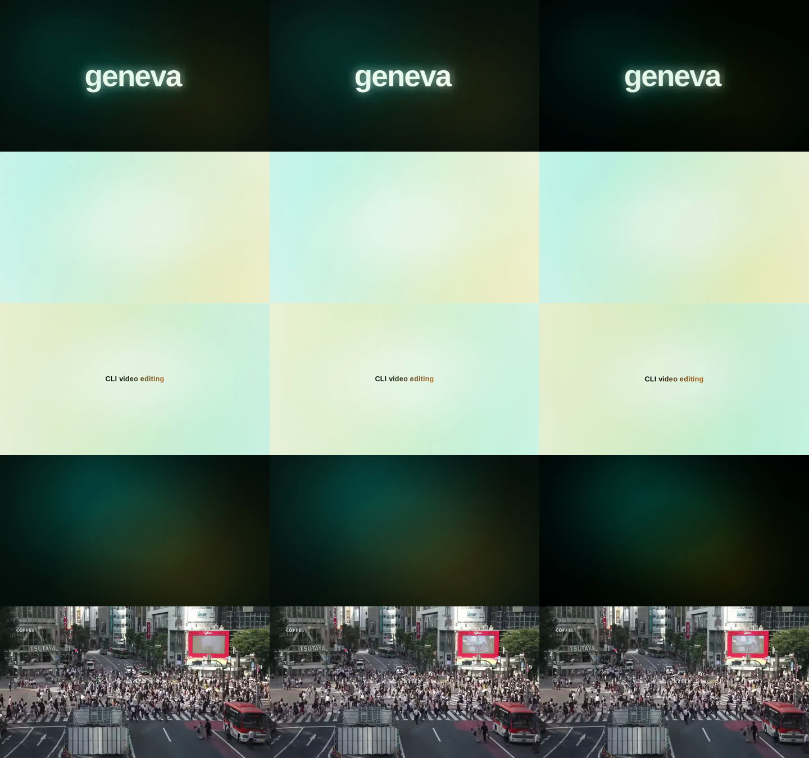
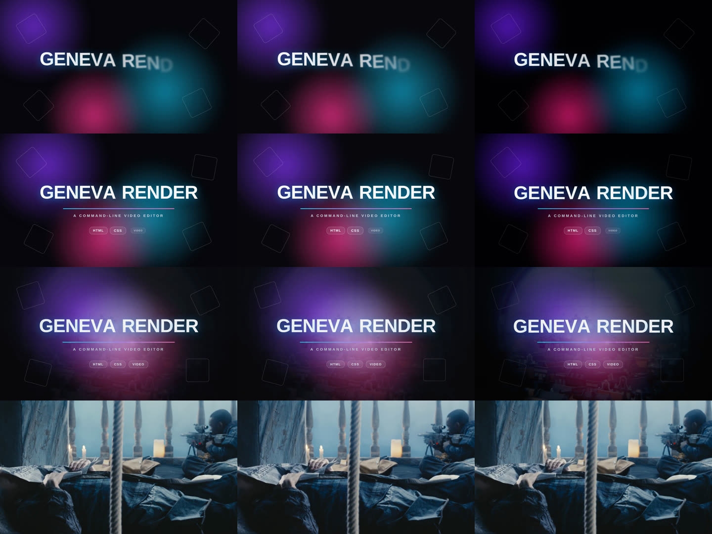
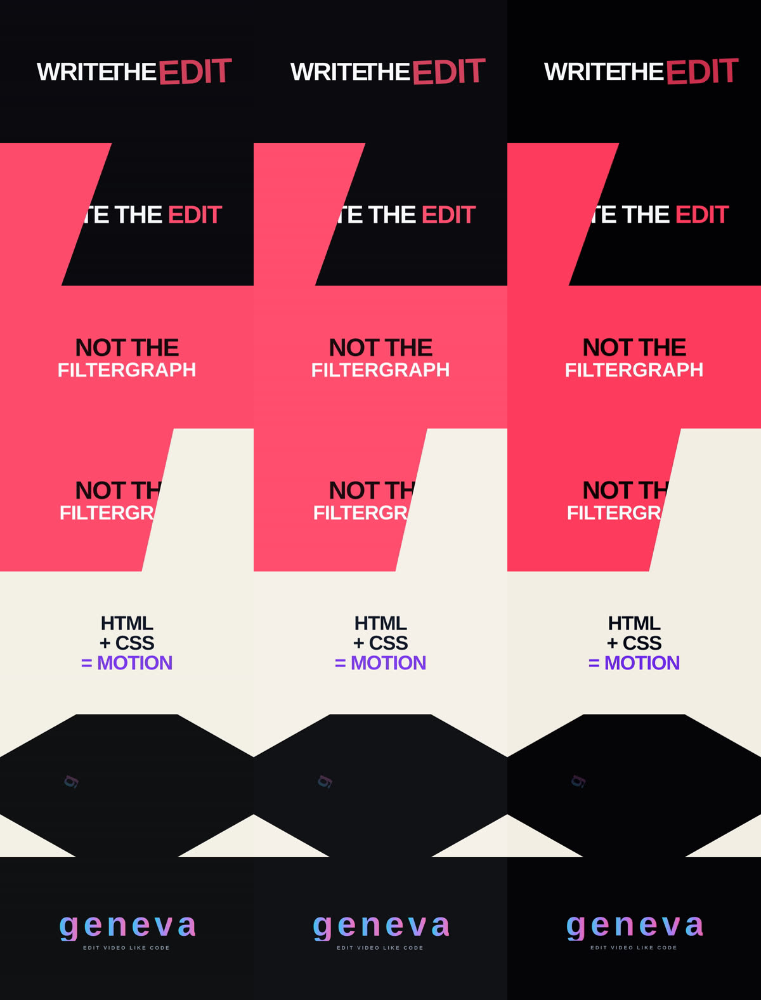

# Benchmarks

How long geneva takes against the two ways people put HTML and CSS
graphics on video today: a headless browser screenshotting each frame for
ffmpeg to lay over the footage (Playwright + ffmpeg), and
[Remotion](https://www.remotion.dev). Seven jobs, from a vertical social
clip to a four-minute subtitle burn to pure motion graphics with no
footage at all.

**In short:** geneva is quicker than both on all seven jobs. With footage
it is 2 to 5 times quicker than Playwright + ffmpeg and 3 to 6 times
quicker than Remotion, on 3 to 7 times less CPU than Remotion. On the
three pieces of motion graphics with no footage it is about twice as
quick as Remotion and 4 to 6 times quicker than Playwright + ffmpeg.

All of it was measured on one machine: a cloud VM (KVM) with 4 vCPUs of
an Intel Xeon at 2.1 GHz, 16 GB of RAM, Ubuntu 24.04 and no GPU.

Contents: [the jobs](#the-jobs), [results](#results),
[what it says](#what-it-says), [how it was run](#how-it-was-run),
[the smaller test](#the-smaller-test), [caveats](#caveats),
[running it yourself](#running-it-yourself).

## The jobs

Footage is [Tears of Steel](https://mango.blender.org) (CC-BY 3.0,
(C) Blender Foundation), cut from the 1080p release once per job. Captions
are the film's own English subtitles; where a job lights the word being
said, each cue's time is shared out over its words by length, which is
what a transcript without word timings gives.

| Job | Output | Length | What is drawn | Graphics on screen |
| --- | --- | --- | --- | --- |
| [Social clip](#social-clip) | 1080x1920, 24 fps | 60 s | the film blurred to fill the frame under the film fitted, word-lit captions | every frame |
| [Broadcast package](#broadcast-package) | 1920x800, 24 fps | 3 min | intro card, three wipes, four lower thirds, the film's subtitles | about a quarter of the time |
| [Static captions](#static-captions) | 1920x800, 24 fps | 4 min | outlined subtitles, 51 cues | 37% of the time |
| [Dynamic captions](#dynamic-captions) | 1920x800, 24 fps | 90 s | word-lit captions, three name cards, a LIVE badge with a pulse and a sheen | every frame (the badge) |
| [Opening](#opening) | 960x540, 30 fps | 13 s | [`examples/opening.html`](../examples/opening.html), 68 keyframe rules, then footage fading in | the first 9.7 s |
| [Intro](#intro) | 1920x1080, 30 fps | 14 s | blurred colour blobs in `screen`, rotating outlines, sweeping bars, a title rising letter by letter out of a blur; lifts away into footage | the first 10 s, full frame |
| [Kinetic typography](#kinetic-typography) | 1920x1080, 30 fps | 16 s | four phrases on panels wiping in through `clip-path`, each word with its own motion, gradient letters spinning in | every frame, full frame |

Each picture below shows the same moments from all three tools, left to
right: **Playwright + ffmpeg, Remotion, geneva**. They were compared
before anything was timed, so each tool was timed drawing the same video.

### Social clip



### Broadcast package



### Static captions



### Dynamic captions



### Opening



### Intro



### Kinetic typography



## Results

Wall time and the CPU time the whole machine spent, median of three
rounds, on the 4-vCPU Xeon VM described above. Every tool encodes x264 at
CRF 23, preset `medium`, 4:2:0.

| Job | geneva | Playwright + ffmpeg | Remotion |
| --- | --- | --- | --- |
| Social clip, 60 s | **60.8 s** (207 s CPU) | 140.6 s (319 s) | 270.3 s (1023 s) |
| Broadcast package, 3 min | **52.2 s** (170 s) | 244.2 s (586 s) | 324.3 s (1113 s) |
| Static captions, 4 min | **95.6 s** (323 s) | 300.4 s (773 s) | 444.7 s (1576 s) |
| Dynamic captions, 90 s | **58.1 s** (211 s) | 190.9 s (372 s) | 164.7 s (560 s) |
| Opening, 13 s | **10.0 s** (27 s) | 64.2 s (85 s) | 19.1 s (50 s) |
| Intro, 14 s | **30.4 s** (96 s) | 145.0 s (223 s) | 63.4 s (156 s) |
| Kinetic typography, 16 s | **14.2 s** (42 s) | 56.2 s (84 s) | 30.2 s (58 s) |

The geneva column is geneva with its defaults. With the encoder pinned to
the other tools' settings, which also turns its frame copying off, the
broadcast package takes 99.4 s and the static captions 140.7 s; the
other jobs are within a second of the figures above.

How much quicker geneva is, on wall time:

| Job | than Playwright + ffmpeg | than Remotion |
| --- | --- | --- |
| Social clip | 2.3x | 4.4x |
| Broadcast package | 4.7x | 6.2x |
| Static captions | 3.1x | 4.7x |
| Dynamic captions | 3.3x | 2.8x |
| Opening | 6.4x | 1.9x |
| Intro | 4.8x | 2.1x |
| Kinetic typography | 4.0x | 2.1x |

Every run is in [`benchmarks/real-world/results`](../benchmarks/real-world/results/).
Most rounds were within 10% of each other. The shortest jobs varied most
(geneva's kinetic runs took 13.6 to 18.1 s), and no round changed which
tool was quicker.

## What it says

- **With footage, geneva is 2 to 6 times quicker.** The browser routes
  take a screenshot of every frame that has graphics on it and encode
  separately; geneva decodes, draws and encodes in one pass, compositing only
  where the graphics are, and with its defaults copies the
  stretches the graphics leave alone. That copying is why the longest,
  sparsest jobs show the widest gaps: the broadcast package takes 52.2 s
  with it and 99.4 s without.
- **Without footage, geneva is about twice as quick as Remotion.** Both
  draw every frame here, so this is painter against painter. geneva
  paints only what can show: a panel waiting to wipe in is not painted,
  nothing under an opaque panel is, and a large soft shape is blurred
  once and kept rather than blurred again each frame. These runs used
  geneva's CPU renderer; its GPU renderer was not measured.
- **Playwright + ffmpeg is slowest on motion graphics.** It captures one
  frame at a time in one tab, so it trails wherever every frame has to be
  drawn, where Remotion's four tabs pay off. On footage it is quicker
  than Remotion, which screenshots every frame whatever is on it, except
  on the dynamic captions, whose badge puts graphics on every frame.

## How it was run

- **geneva** at `c9e6dd5` on `main` (1.0.0 and the fixes since),
  release build, the system's x264 (build 164), CPU renderer.
- **Playwright + ffmpeg**: Playwright 1.56.1 with Chromium's headless
  shell (build 1194) screenshots each frame that has graphics on it, with
  every CSS animation paused and set to the frame's time. Frames with
  nothing on them reuse one blank picture, so they cost no screenshot,
  which is the kindest setup for this route. ffmpeg 6.1.1 then lays the
  pictures over the footage and encodes; for the social clip it also
  builds the blurred fill.
- **Remotion** 4.0.526 on the same Chromium, set up the way that was
  quickest in an earlier test: bundled once, JPEG frames, four tabs
  (`--concurrency 4`). Its documentation says not to drive animation with
  CSS keyframes, so the broadcast, social and caption graphics were
  ported to `interpolate()` on the frame number, using the same curves
  as the HTML files. The three motion pieces (opening, intro, kinetic)
  have dozens of keyframe rules each, so they were mounted unchanged and
  every CSS animation was paused and set to the frame's time before each
  frame was taken, which gives the same picture whatever order frames are
  rendered in.
- **The machine**: a cloud VM (KVM) with 4 vCPUs of an Intel Xeon at
  2.1 GHz and 16 GB of RAM, Ubuntu 24.04, CPU only, nothing
  else running. Three rounds, the tools taking turns within each round.
  CPU is the machine's busy time over each run, read from `/proc/stat`,
  because the shell's own timer misses processes Chromium starts.

## The smaller test

The name card over nine seconds of 720p footage in the
[README](../README.md), timed the same way on the same machine:

| Job | geneva | Playwright + ffmpeg | Remotion, bundled once |
| --- | --- | --- | --- |
| Name card and word captions | **4.3 s** (13 s CPU) | 16.4 s (28 s) | 14.5 s (42 s) |
| Name card alone | **2.8 s** (8 s) | 9.9 s (19 s) | 14.8 s (43 s) |

A browser tool's fixed start-up cost is part of that. Timed on one frame,
it is 0.1 s for geneva, 0.5 s for Playwright and 2.1 s for Remotion, so
the per-frame costs on the captioned job are about 15 ms, 59 ms and 46 ms,
and the ratios are not a start-up effect.

## Caveats

- **One machine.** The seconds are this 4-core machine's; the ratios are
  the finding. A dedicated machine, and a GPU, would move all three
  columns.
- **Remotion is often spread over many machines.** Its usual deployment
  renders across cloud functions, which cuts wall time and adds work; the
  CPU figures are the part that does not change.
- **The ports are this harness's.** The Remotion compositions and the
  Playwright pages were written for this test and checked by eye against
  each other, not by a pixel metric. A hand port of the three motion
  pieces could be quicker or slower than setting CSS animations frame by
  frame.
- **Colour tags differ.** Remotion's JPEG path writes full-range video
  tagged BT.470BG, Playwright's ffmpeg command leaves the colour space
  untagged, geneva writes BT.709. That changes how a player shows the
  file, not how long it took to make.

## Running it yourself

Everything is in [`benchmarks/real-world`](../benchmarks/real-world/):
the geneva documents, the graphics as HTML, the Playwright pages, the
Remotion projects and the scripts. The film is not in the repository;
`fetch.sh` downloads it.

```sh
cd benchmarks/real-world
./fetch.sh                                   # Tears of Steel and its subtitles into src/
python3 derive-captions.py                   # optional: rebuilds the committed caption files
set1/prepare.sh && set2/prepare.sh           # cuts the film, installs Remotion and Playwright
(cd set1/pw && npx playwright install chromium) && (cd set2/pw && npx playwright install chromium)
GENEVA=geneva set1/bench.sh 3                # social, broadcast, opening; three rounds
GENEVA=geneva set2/bench.sh 3                # intro, kinetic, captions, dynamic
```

It needs Linux (for `/proc/stat`), Node 22, ffmpeg with `libx264`, and
`bc`. Set `CHROME` to a Chromium binary to have Remotion use it rather
than the one it downloads. Each run adds a line to `results.txt` in its
set: tool, job, round, wall seconds and CPU seconds. `out/` keeps the
last video from each tool.
